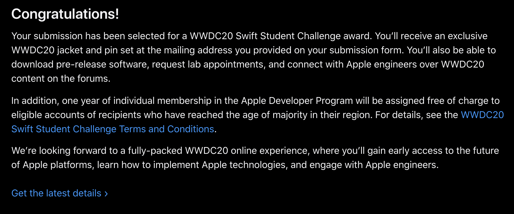

<h1 align="center">
    
</h1>

<h3 align="center">
	My submission to the Apple's Swift Student Challenge
</h3>

  

  

  

  <a href="#information_source-project">Project</a>&nbsp;&nbsp;&nbsp;|&nbsp;&nbsp;&nbsp;
  <a href="#rocket-technologies">Technologies</a>&nbsp;&nbsp;&nbsp;|&nbsp;&nbsp;&nbsp;
  <a href="#-how-to-play">How to play</a>

## :information_source: Project

This project is a fun game about my last day in high school. In this game you have to make all the important decisions for me, but don't forget: there's a consequence for each one!

    

## :rocket: Technologies

This project was built using:

- [Swift][swift]
- [SpriteKit](spritekit)
- [Piskel](piskel)

## 🎮 How to play

Just download this repository and run it in xcode 11.4+

## 🎉 Status

    

---

<i>With 💜, by Leonardo Viana.</i>

[swift]: https://developer.apple.com/swift/
[spritekit]: https://developer.apple.com/spritekit/
[piskel]: https://www.piskelapp.com/
[vceditconfig]: https://marketplace.visualstudio.com/items?itemName=EditorConfig.EditorConfig
[vceslint]: https://marketplace.visualstudio.com/items?itemName=dbaeumer.vscode-eslint
[prettier]: https://marketplace.visualstudio.com/items?itemName=esbenp.prettier-vscode
